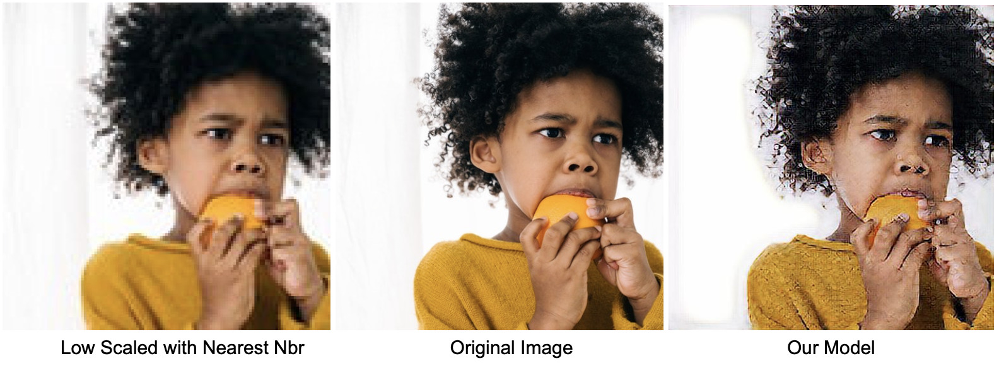

# ResampleGAN

### Resample LQ images to HQ using Generative Adversarial Networks

---

## Results

The following models have been created for rough reference:




---

## Tools:

We'll be working with these currently for rapid prototyping and realising the models:

- [x] Tensorflow
- [x] Keras
- [x] Pandas
- [x] Numpy
- [x] Matplolib
- [x] PILlow

---

## Clone this repo

Install git from [here(windows)](https://git-scm.com/download/win) or in mac, run:
Note: You can skip installing git on a mac if you have xcode command line tools installed

```bash
/bin/bash -c "$(curl -fsSL https://raw.githubusercontent.com/Homebrew/install/master/install.sh)"
brew install git
```

After that, just run

```bash
git clone https://github.com/grajat90/ResampleGAN
cd ResampleGAN && git init
git remote add origin git@github.com:grajat90/ResampleGAN.git
git pull origin
```
